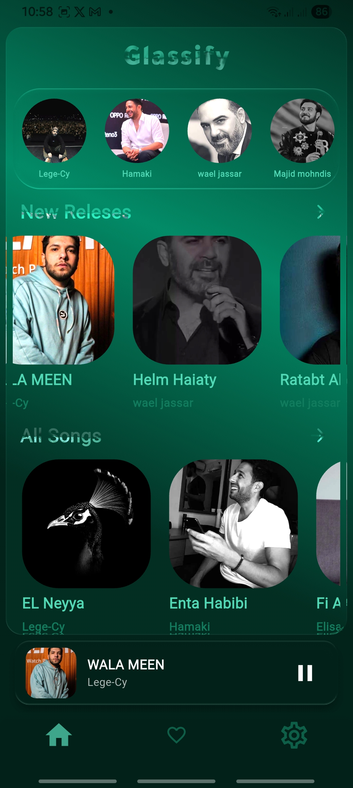
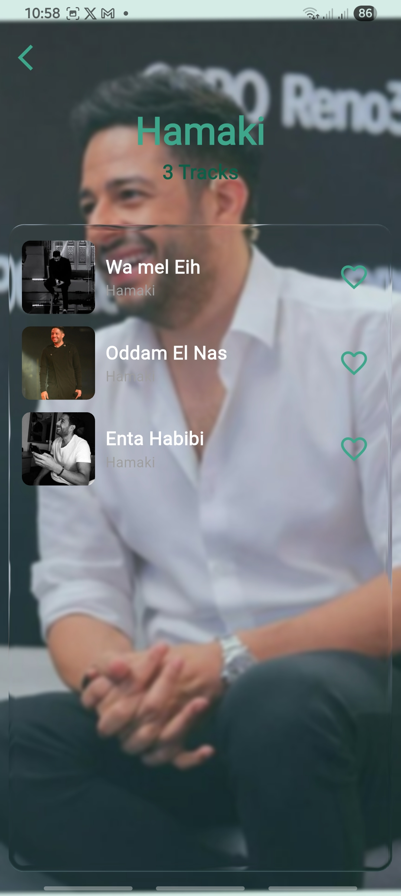
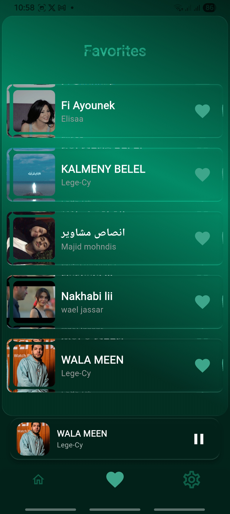
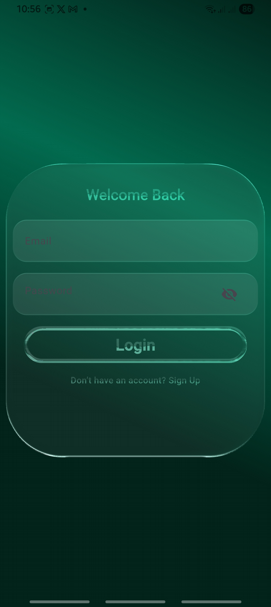
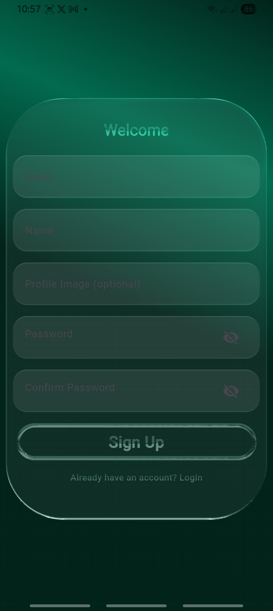
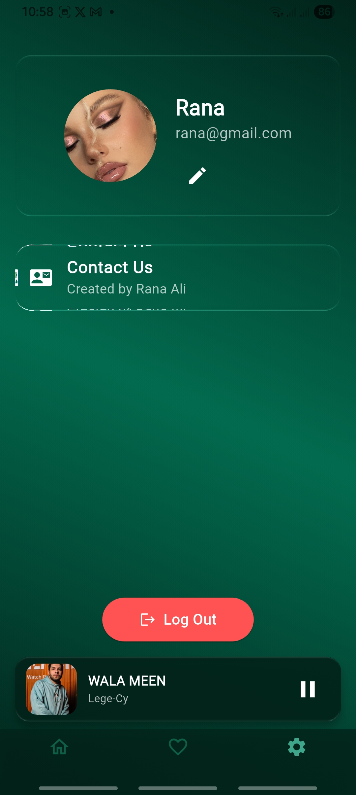
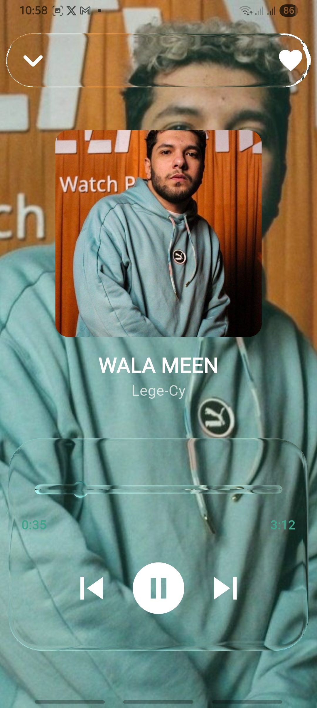

Glassify is a music app designed with a glassmorphism UI:

- Browse & Play Songs – Smooth and minimal player .
- User Authentication – Firebase Auth for sign-in and sign-up.
- Favorites – Save your liked songs to a personalized list stored in Firestore.
- Artist Profiles – View artists and their tracks in a clean layout.
- Persistent & Background Playback – Keep the music playing across screens 
and even when minimized, powered by audio_service and just_audio
- page setting 

Tech stack:

Flutter + Riverpod for state management

Firebase (Auth + Firestore) as backend

Liquid Glass Renderer for gorgeous glassmorphism effects

Feature-Based Architecture with custom reusable widgets and clean separation of views, controllers, and services

##  Screenshots
<table>
  <tr>
    <td align="center">
      
       <b>Home Screen</b>
    </td>
    <td align="center">
      
       <b>Artist Songs</b>
    </td>
    <td align="center">
      
       <b>Artist Songs (Variant)</b>
    </td>
  </tr>
  <tr>
    <td align="center">
      
       <b>Favorites</b>
    </td>
    <td align="center">
      
       <b>Login</b>
    </td>
    <td align="center">
      
       <b>Signup</b>
    </td>
  </tr>
  <tr>
    <td align="center">
      
       <b>Settings</b>
    </td>
    <td align="center">
      
       <b>Song Details</b>
    </td>

  </tr>
</table>

<i>Clean & modern UI – fully responsive on Android & iOS 📲</i>

---

##  About

Built by **Rana**  
Using Flutter and BLoC for clean and scalable development.
